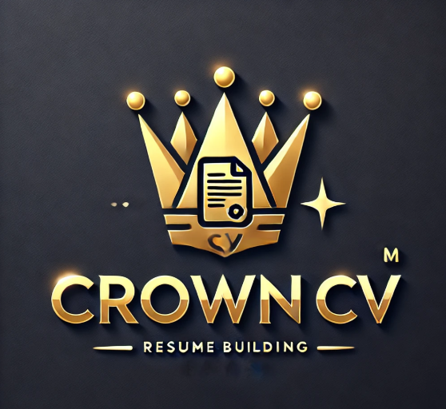
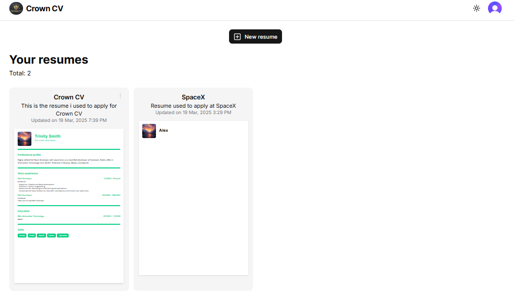
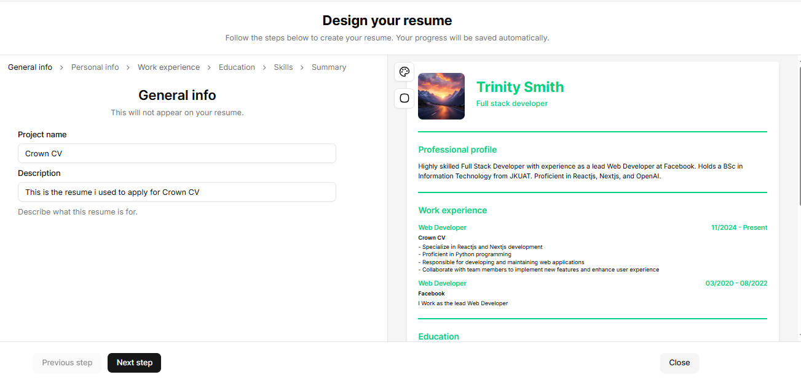
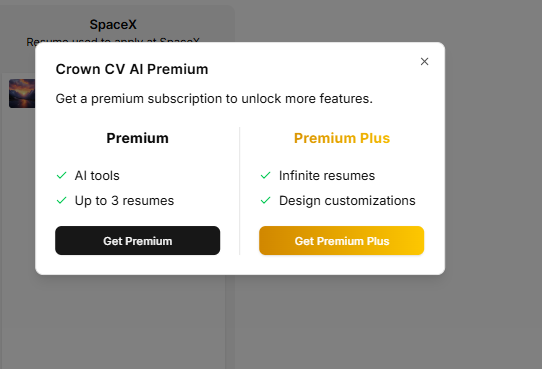
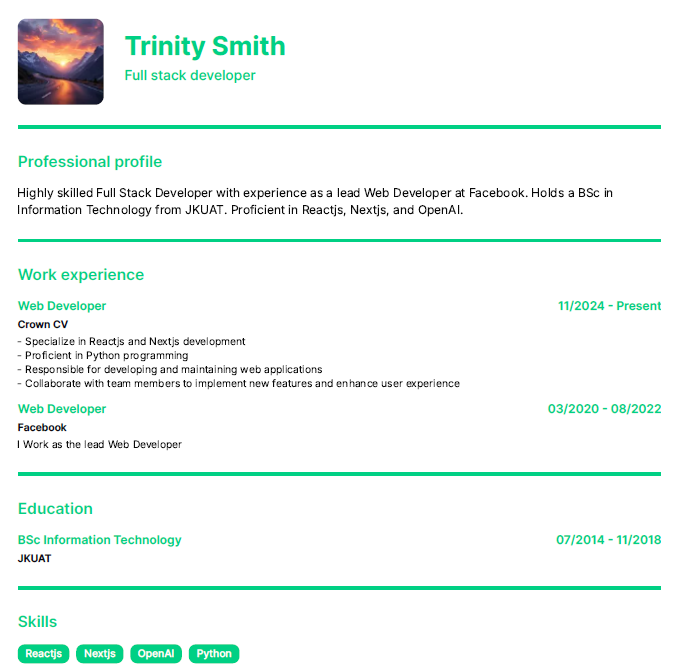

<h1 align="center">Crown CV - AI-Powered Resume Builder</h1>

<p align="center">
  <b>Generate professional resumes effortlessly with AI-powered assistance.</b>
</p>

<p align="center">
  <a href="https://crown-cv.vercel.app/" target="_blank"><b>🔗 Live Demo</b></a> •
  <a href="#features"><b>🚀 Features</b></a> •
  <a href="#installation"><b>⚙️ Installation</b></a> •
  <a href="#contributing"><b>🤝 Contributing</b></a>
</p>

---

## 🌟 About Crown CV

Crown CV is a **SaaS application** that allows users to build professional resumes using AI-powered suggestions. Users can dynamically edit and customize their resumes, leveraging AI to enhance their **work experience, professional summaries, and formatting** with ease.

## 🚀 Features

✅ **AI Resume Generation** – Automatically generate work experiences and summaries with OpenAI.  
✅ **Live Resume Preview** – See real-time updates as you fill out your resume.  
✅ **Drag & Drop** – Reorder work experience and education sections effortlessly.  
✅ **Autosave** – Resume content is automatically saved after 2 seconds of inactivity.  
✅ **Customization Options** – Adjust skill badge styles, profile picture shapes, and resume colors.  
✅ **Dark Mode** – A sleek and modern dark mode interface.  
✅ **Print & Download** – Save or print your resume directly.  
✅ **Secure Authentication** – Sign in with **Clerk** authentication.  
✅ **Subscription System** – Unlock premium features via **Stripe-powered subscriptions**.  
✅ **Optimized Storage** – Store profile images securely with **Vercel Blobs**.  
✅ **Fast & Scalable** – Built with **Next.js 15, Prisma, PostgreSQL, and Zustand** for efficiency.

## 🏗️ Tech Stack

- **Frontend:** Next.js 15, TypeScript, Tailwind CSS, shadcn
- **State Management:** Zustand
- **Backend:** PostgreSQL, Prisma ORM, OpenAI API
- **Authentication:** Clerk
- **File Storage:** Vercel Blobs
- **Payments:** Stripe
- **Forms:** React Hook Form, shadcn UI

## ⚙️ Installation

```bash
# Clone the repository
git clone https://github.com/alexkasema/crown-cv.git
cd crown-cv

# Install dependencies
yarn install  # or npm install

# Run the development server
yarn dev  # or npm run dev
```

## 📜 Environment Variables

Make sure to set up a `.env` file with the following variables:

```plaintext
POSTGRES_URL_NON_POOLING=
POSTGRES_PRISMA_URL=
CLERK_SECRET_KEY=
BLOB_READ_WRITE_TOKEN=
DATABASE_URL=
OPENAI_API_KEY=
STRIPE_SECRET_KEY=
STRIPE_WEBHOOK_SECRET=
NEXT_PUBLIC_CLERK_PUBLISHABLE_KEY=
NEXT_PUBLIC_CLERK_SIGN_IN_URL=
NEXT_PUBLIC_CLERK_SIGN_UP_URL=
NEXT_PUBLIC_STRIPE_PUBLISHABLE_KEY=
NEXT_PUBLIC_STRIPE_PRICE_ID_PRO_MONTHLY=
NEXT_PUBLIC_STRIPE_PRICE_ID_PRO_PLUS_MONTHLY=
NEXT_PUBLIC_BASE_URL=
```

## 📌 Usage

1. **Sign up or log in** using Clerk authentication.
2. **Fill in resume details** (Personal Info, Work Experience, Education, Skills, Summary).
3. **Use AI assistance** to generate professional resume sections.
4. **Customize the resume** with different styles and themes.
5. **Upgrade to premium** for extra features.
6. **Download or print** your resume.

## 🛠️ Deployment

Crown CV is deployed on **Vercel**. To deploy your own version:

1. Push your code to GitHub.
2. Connect your repository to **Vercel**.
3. Set environment variables in **Vercel Dashboard**.
4. Deploy with a single click!

## 📖 Contributing

Contributions are welcome! 🚀 If you’d like to improve **Crown CV**, follow these steps:

1. Fork the repository.
2. Create a new branch (`git checkout -b feature-name`).
3. Make your changes and commit (`git commit -m "Add new feature"`).
4. Push to your fork (`git push origin feature-name`).
5. Open a **Pull Request**.

## 📸 Screenshots







## 🛡️ License

This project is licensed under the **MIT License**.

## 📬 Contact

For questions or collaborations, reach out via:

- **Email:** lexmulwa@gmail.com
- **LinkedIn:** [Alex Kasema](https://www.linkedin.com/in/alexkasema/)

---

<p align="center">💡 <b>Empower your career with Crown CV! Build your resume in minutes.</b></p>

---
